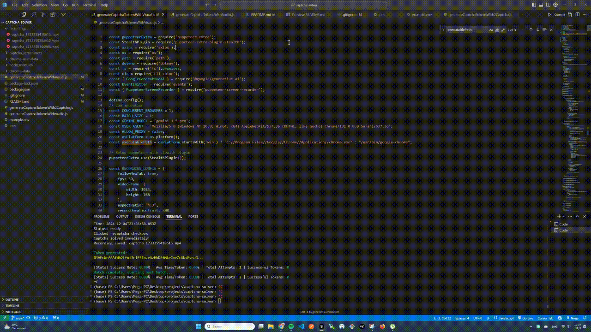

# ReCaptcha V2 Solver

A collection of methods to solve Google ReCaptcha v2 challenges using different approaches. This project provides three different methods to bypass ReCaptcha:

## Available Methods

### 1. 🎧 Audio Challenge Method 
- Uses wit.ai to transcribe ReCaptcha audio challenges
- Requires FREE wit.ai API keys
- Average success rate: 70-80%

### 2. 👥 2Captcha Service
- Uses paid human captcha solving service
- Most reliable but costs money ($2.99 per 1000 solves)
- Requires 2captcha API key
- Success rate: 95%+

### 3. 🤖 Visual Challenge Method (Experimental)
- Uses AI (Gemini) to solve visual challenges
- Experimental and less reliable
- requires Free Gemini API key
- Success rate: varies

## Visual Challenge bypass demo: See Google Gemini solving Google ReCaptcha in action



## Installation

```bash
npm install recaptcha-v2-solver
```

## Basic Usage Examples

### Audio Method
```javascript
const { generateCaptchaTokensWithAudio } = require('recaptcha-bypass-solutions');
const EventEmitter = require('events');

const eventEmitter = new EventEmitter();

eventEmitter.on('tokenGenerated', ({ token }) => {
    console.log('Got token:', token);
});

await generateCaptchaTokensWithAudio({
    eventEmitter,
    captchaUrl: 'https://your-target-website.com/page-with-recaptcha',
    wit: {
        apiKeys: ['YOUR_WIT_TOKEN']
    }
});
```

### Visual Method (Gemini)
```javascript
const { generateCaptchaTokensWithVisual } = require('recaptcha-bypass-solutions');
const EventEmitter = require('events');

const eventEmitter = new EventEmitter();

eventEmitter.on('tokenGenerated', ({ token }) => {
    console.log('Got token:', token);
});

await generateCaptchaTokensWithVisual({
    eventEmitter,
    captchaUrl: 'https://your-target-website.com/page-with-recaptcha',
    gemini: {
        apiKey: 'YOUR_GEMINI_API_KEY'
    }
});
```

### 2Captcha Method
```javascript
const { generateCaptchaTokensWith2Captcha } = require('recaptcha-bypass-solutions');
const EventEmitter = require('events');

const eventEmitter = new EventEmitter();

eventEmitter.on('tokenGenerated', ({ token }) => {
    console.log('Got token:', token);
});

await generateCaptchaTokensWith2Captcha({
    eventEmitter,
    captchaUrl: 'https://your-target-website.com/page-with-recaptcha',
    "2captcha": {
        apiKey: 'YOUR_2CAPTCHA_API_KEY'
    }
});
```

See [/examples](./examples) directory for more complete working examples.

## Events

Each solver emits the following events:

```javascript
// 1. Token successfully generated
solver.on('tokenGenerated', (data) => {
    console.log(data);
    // {
    //     token: "03AGdBq24PBgq_DRbWL..."  // reCAPTCHA token
    // }
});

// 2. Error during token generation
solver.on('tokenError', (data) => {
    console.log(data);
    // {
    //     error: "Failed to solve captcha: Network error"
    // }
});
```

## Configuration Options

Full configuration options with all possible settings:

```javascript
{
    eventEmitter: EventEmitter,          // Required: Event emitter instance
    captchaUrl: 'https://example.com',   // Required: URL of the page containing reCAPTCHA
    tokensToGenerate: 3,                 // Optional: Number of tokens to generate (default: Infinity)
    concurrentBrowsers: 2,               // Optional: Number of concurrent browser instances (default: 1)
    tabsPerBrowser: 1,                   // Optional: Tabs per browser (default: 1)
    
    // Browser settings
    browser: {
        headless: true,                  // Optional: Run in headless mode (default: true)
        executablePath: '/path/to/chrome',// Optional: Chrome executable path
        userAgents: ['Mozilla/5.0...']   // Optional: Array of user agents to rotate
    },
    
    // Proxy settings
    proxy: {
        enabled: false,                  // Optional: Enable proxy (default: false)
        host: 'proxy.example.com',       // Required if proxy enabled
        port: '8080',                    // Required if proxy enabled
        username: 'user',                // Optional: Proxy authentication
        password: 'pass'                 // Optional: Proxy authentication
    },
    
    // Logger settings
    logger: {
        level: 'info'                    // Optional: 'error' | 'warn' | 'info' | 'debug' | 'silent'
    },
    
    // Method-specific options:
    
    // Audio Method only:
    wit: {
        apiKeys: [                       // Required for Audio method: Array of wit.ai API keys
            'WIT_TOKEN_1',
            'WIT_TOKEN_2'
        ]
    },
    
    // Visual Method only:
    gemini: {
        apiKey: 'GEMINI_API_KEY',       // Required for Visual method: Gemini API key
        model: 'gemini-1.5-flash'       // Optional for Visual method: Gemini model (default: 'gemini-1.5-flash')
    },
    
    // 2Captcha Method only:
    "2captcha": {
        apiKey: '2CAPTCHA_API_KEY'      // Required for 2Captcha method: 2captcha API key
    }
}
```

## Notes

- Use proxies to prevent IP bans
- Rotate user agents and browser profiles
- Handle rate limiting appropriately
- Consider legal and ethical implications

## Disclaimer

This project is for educational purposes only. Use of automated systems to bypass CAPTCHAs may violate terms of service of some websites. Always ensure you have permission to use automated solutions on target websites.

